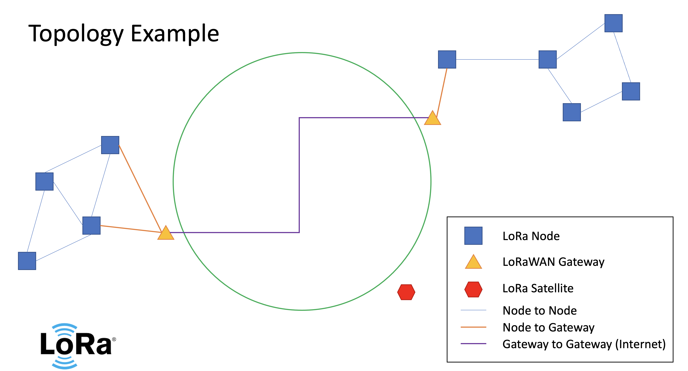

# Sprint 1

## Product Mission

### Objective 1

Build a software interface to easily implement micro-controler applications into LoRa communication networks (LoRa/LoRaWAN) specifically for robotics and sensing applications.

### Objective 2

create an interface for LoRaWAN on the FABRIC testbed network to enable research into edge computing, mesh networks, swarm robotics and other common LoRa applications.

## Literature Review

To the best of our knowledge, no open-source software package for robotics interface into LoRa exists, and most researchers build their interface individually for each project. While many libraries exist for LoRa in general and fairly easy to implement, we seek to develop a 'plug-and-play' solution to take any existing micro-controller based project that could benefit from low powered long range communication, and add LoRa to their project through a number of common serial protocols.

## MVP and MVP User stories

### Minimum Value Product

For robotics and sensor developers who deploy devices in areas a long distance from each other and physically away from other communication technologies.  Our product is a software package that interprets a serial message from a microcontroler at one node, sends the message via LoRa to another LoRa Node, and delivers the message to a second microcontroler at that node. Unlinke other LoRa software packages that have to be learned and interpreted to implement into specific code bases, this software package translates the LoRa protocols into serial communication for ease of implementation into any code base.

### User Stories

"I, oceanography researcher and climate scientist, use this product to coordinate the communication of my ocean sensors to send their information back to my research lab."

"I, the wilderness/adventure tour guide, use this product to implement messaging on for my clients to their family, when we're away from civilization"

"I, the swarm robotics researcher, use this product to send messages between my robots to communicate their respective locations and redistribute themselves based on external changes to their topology."  

## Technologies and Use Reasoning

LoRa Radio

- broad industry support
- long range (5-15km)
- low power
- secure/encrypted

LoRaWAN

- Extends range of LoRa to the span of the Internet
- 40,000+ existing Gateways

## Development Environment setup

GitHub will be used to conduct all code management, issue tracking and project development.

Discord will be used for all team messaging communication.

## Sprint 2 Plan

do stuff.  
